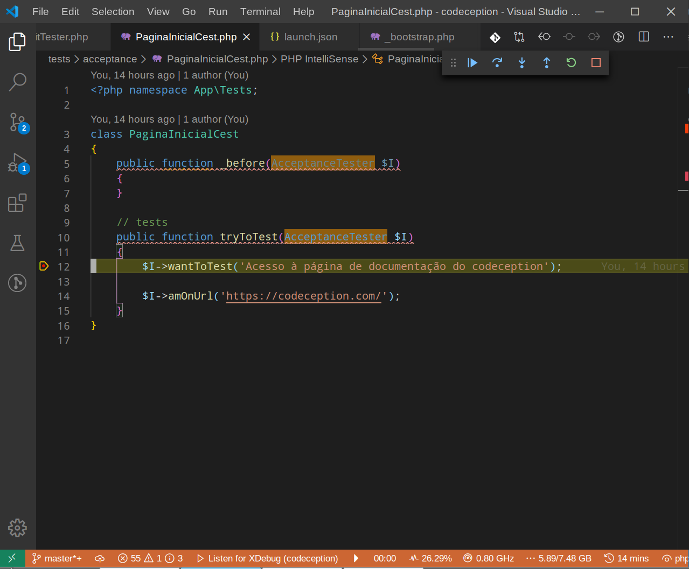

#  Exemplo uso Codeception + Selenium + PHP

## Web server

Para rodar, execute:

```
$ docker exec -it app php -S 0.0.0.0:8000 -t /var/www/html/public
```

## Debugger

Para usar o xdebug, entre no container com o comando:

```
$ docker exec -it --workdir /var/www/html --user developer app bash
```

Dentro do container, crie os aliases para rodar o codeception com e sem xdebug.

### Com XDebug

```
alias xcodecept=/usr/bin/php $PWD/vendor/bin/codecept"
```

Adicione os steps e execute os testes:

```
$ xcodecept run
```



### Sem XDebug

```
alias codecept=/usr/bin/php -n $PWD/vendor/bin/codecept"
```
